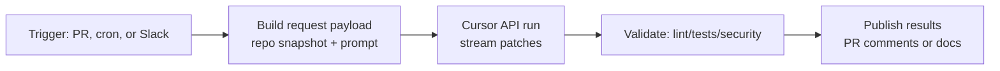

Cursor API Research – Use Cases
================================

Overview
--------
- Cursor exposes an API that mirrors many of the in-editor agent capabilities (repo-scale reasoning, context-aware editing, automated refactors) so that teams can script repeatable workflows outside the IDE.
- Typical consumers are internal tooling teams that want the Cursor experience in CI/CD, documentation bots, or batch remediation pipelines.
- Authentication flows reuse Cursor user or organization API keys; requests are made over HTTPS with streaming responses for long-running generations.

High-Value Use Cases
--------------------
1. Automated Code Reviews  
   - Kick off Cursor agent runs on every pull request to highlight regressions, draft comments, or even push fixes to a temporary branch.  
   - Combine with GitHub Actions to triage issues before human review, especially on large mono-repos.
2. Batch Refactors / Remediations  
   - Feed Cursor structured prompts (e.g., “replace deprecated API X with Y across modules A,B,C”) and let it apply patches programmatically.  
   - Works well for security-driven upgrades or license changes where the instructions are deterministic.
3. Documentation Synchronization  
   - Schedule nightly jobs that ask Cursor to re-summarize code changes into Markdown docs or internal wikis, ensuring alignment between source and docs.
4. Conversational Test Authoring  
   - Pipe failing CI logs and source snippets into the API so Cursor can propose targeted unit tests or property-based tests aligned with the failure mode.
5. Data-Aware Coding Assistants  
   - Couple internal design docs or ADRs as retrieval-augmented context, letting Cursor reason over both natural-language specs and the repo simultaneously.

Integration Patterns
--------------------
- **Server-triggered agents**: lightweight microservice that wakes Cursor runs via cron or webhook (GitHub, Jira, PagerDuty) and stores the diffs.  
- **CLI tooling**: wrap the API in a dev-tool binary so engineers can request “cursor-fix” locally with consistent prompts.  
- **ChatOps**: Slack/Teams bot that forwards `/cursor` commands, streams responses back to the channel, and opens PRs automatically.

Key Implementation Considerations
---------------------------------
- **Context windows**: keep file batches below 200–400 kB per request; otherwise switch to iterative plans (coarse plan request + per-file edit requests).  
- **Prompt templates**: enforce deterministic structure (objectives, constraints, acceptance tests) so responses are easier to parse.  
- **Diff verification**: always run `git apply` + formatter + tests before pushing AI-generated patches.  
- **Observability**: log prompt/response hashes and track win rates (accepted vs. rejected diffs) to refine prompts.  
- **Cost controls**: throttle concurrent runs and enforce model selection (e.g., smaller models for lint fixes, flagship models for architectural refactors).

Sample Workflow Skeleton
------------------------

KPIs to Track
-------------
- % of AI-suggested diffs merged without edits  
- Median time-to-fix for repetitive classes of bugs before vs. after automation  
- Number of docs/tests auto-updated per release  
- Cost per successful automation (API tokens + compute)  
- Human satisfaction ratings (survey via lightweight emoji feedback)

Sources & Further Reading
-------------------------
- Cursor product updates and API notes: <https://cursor.com/blog>  
- Cursor help center & FAQ: <https://www.cursor.com/faq>  
- Example GitHub Action wrapper (community): <https://github.com/gkamradt/cursorctl>  
- Prompt engineering best practices for code agents (OpenAI): <https://platform.openai.com/docs/guides/code>
